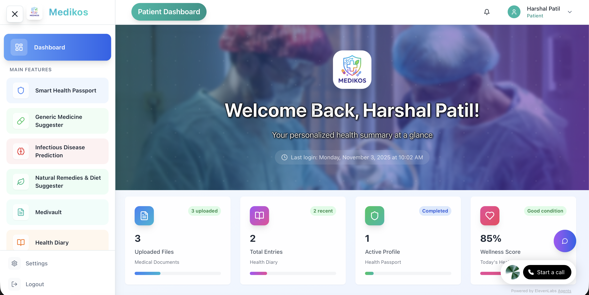

# Medikos - AI-Powered Healthcare Platform

A comprehensive healthcare management platform built with React, TypeScript, and modern web technologies. Medikos provides patients, doctors, and administrators with intelligent healthcare solutions including AI-powered diagnostics, health passport management, and seamless medical record handling.



## 🚀 Features

### For Patients
- **Smart Health Passport**: Comprehensive health profile with medical history, allergies, and emergency contacts
- **AI Voice Assistant**: ElevenLabs-powered voice interactions for health consultations
- **MediVault**: Secure document storage and management for medical records
- **Health Diary**: Daily health tracking with symptom logging and wellness monitoring
- **Generic Medicine Suggester**: AI-powered alternative medicine recommendations
- **Natural Remedies**: Diet and lifestyle advice based on health conditions

### For Doctors
- **Patient Management**: Comprehensive patient profiles and medical history access
- **AI Diagnostics**: Intelligent diagnosis assistance and treatment recommendations
- **Consultation Management**: Schedule and manage patient appointments
- **Analytics Dashboard**: Performance metrics and patient care insights

### For Administrators
- **System Management**: User management, role assignments, and system monitoring
- **Analytics & Reporting**: Comprehensive healthcare metrics and system usage statistics

## 🛠️ Tech Stack

- **Frontend**: React 18, TypeScript, Vite
- **UI Framework**: Radix UI, shadcn/ui, Tailwind CSS
- **State Management**: React Query, Context API
- **Routing**: React Router v6
- **Forms**: React Hook Form, Zod validation
- **Icons**: Lucide React
- **AI Integration**: ElevenLabs Voice Assistant

## 📦 Installation

```bash
# Clone the repository
git clone <repository-url>

# Navigate to project directory
cd Medikos-Frontend

# Install dependencies
npm install

# Create environment file
cp .env.example .env.local

# Start development server
npm run dev
```

## ⚙️ Environment Setup

Create a `.env.local` file with:

```env
VITE_API_BASE_URL=http://localhost:8000
VITE_API_TIMEOUT=30000
```

## 🏗️ Build & Development

```bash
# Development
npm run dev

# Build for production
npm run build

# Preview production build
npm run preview

# Lint code
npm run lint
```

##  API Integration

The frontend integrates with a FastAPI backend running on `http://localhost:8000`. Key endpoints include:

- `/api/auth/*` - Authentication and user management
- `/api/health-passport/*` - Health profile management
- `/api/medivault/*` - Document storage and retrieval
- `/api/health-diary/*` - Health tracking and logging

## 🤝 Contributing

1. Fork the repository
2. Create a feature branch (`git checkout -b feature/amazing-feature`)
3. Commit your changes (`git commit -m 'Add amazing feature'`)
4. Push to the branch (`git push origin feature/amazing-feature`)
5. Open a Pull Request

## 📄 License

This project is licensed under the MIT License - see the [LICENSE](LICENSE) file for details.

## 👥 Authors

- **Harshal Patil** - *Initial work* - [harshalself](https://github.com/harshalself)

## 🙏 Acknowledgments

- Built with [shadcn/ui](https://ui.shadcn.com/) components
- Voice assistant powered by [ElevenLabs](https://elevenlabs.io/)
- Icons by [Lucide React](https://lucide.dev/)
